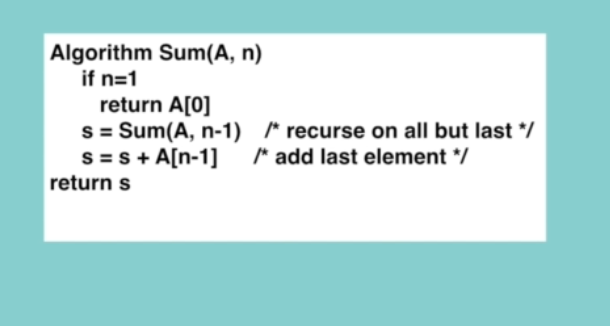

## Topic
> What are the Data Structures
>> Data Structures are different ways of organizing data on your computer that can be used effectively.
> Example: Let say we have a bunch of words here.

>> And it can be easily seen that they are not organized. So if you want to choose a black color of wood, you would face a problem here?
> We need to check all of them one by one and to find out the black one, since these items are not in organize way, selecting black one is time consuming and difficult.

> Ok Let's look at the organized view of these items.

> What have we done here?
>> We have just taken the unorganized items and put them in an organized way, so selecting a Black wood from these list is very easy and it takes less time to find it. You can obviously see that it is at a certain position.

> So when it comes to data structures, we are doing the same thing that we have done here, organizing the items, it is very clear that all softwares are dealing with data.So they do some operations based on given data, before processing the data we have to organize data in a certain way that makes the process very efficient.
From software application performance point of view, the efficiency and the performance of software depends on how the data is stored, organized and grouped together during programming execution.

Everyday during our daily lives, we can see various types of data structures, there might be a crowd of people who want to get a ticket from the concert, but without organized way, it becomes almost impossible to get tickets.The organized way to people to get tickets it is a `queue`, it is also called `queue` data structure in computer science, which is first in, first out, as you see from the picture.


As you can see on the picture the person who came first by the ticket first.So this is called First in, first out in  computer 
Science.

> Another example is imagine there's a bunch of books on the table and you want to return them to the library.

It's obvious that without organized way of ordering, we cannot carry these books.On the other hand, if you order them in this way, it becomes easier to carry them.And this reminds us `stack` data structures in computer science.


Ok, we understand that we use data structure to make our application very efficient, but the problem is that there are many different types of data structures. So which one should we choose for the best performance of software or app?. You will find that answer to this question throughout this course while explaining all data structures and their use cases.

And this is the main reason why big companies like Google, Apple, Amazon or Facebook ask questions about data structures and algorithms from the candidates during their interview process, a professional software developer has to know which data structure to choose for a particular app, which has a direct effect on the performance.

## Keywords & Notes
### What is an algorithm
> Set of steps to accomplish a task.

For Example if you want to use organized  wooden items for `flooring`, we need to accomplish several steps.
* Step 1: Choosing flooring.
* Step 2: Purchase the floor and bring
* Step 3: Prepare sub flooring.
* Step 4: Determine the layout.
* Step 5: Trim door casing.
> so as you can see, we have completed a set of steps to accomplish our task of flooring 

For Example : Algorithms in our daily lives : Going from home to work
* Step 1: Go to bus stop
* Step 2: Take a bus
* Step 3: Go to office.
> The tasks that we perform during the day are all algorithms.

In Computer science, an algorithm is set of rules for computer program to accomplish a task. Learning about different types of algorithms and knowing when to apply them allows us to write time and memory efficient programs.


> Let's look at a few famous algorithms that are used by big companies.

#### How do Google and Facebook transmit live videos across the internet?

The answer is the are using `audio and video compress algorithms` to transmit live videos.

#### How to find shortest part on the map?

These are graph algorithms that are used in Google, Apple and Microsoft Maps to find shortest path `Dijkstra's algorithm` between two location.

#### How to arrange solar panels on the International Space Station?

Two location algorithms are used in space exploration as well. ` Optimization and scheduling algorithms are used by `NASA` to arrange solar panels on the International Space Station.

> So by getting deep knowledge about existing algorithms and applying the right one, can make our programs faster.I
>
>t's also important to know how to design you algorithms as well as how to analyze their correctness and efficiency.

#### What makes a good algorithm?
The first one is algorithms solve the problem correctly and the second one is it does it so efficiently.

1. Correctness
2. Efficiency


### Why are Data Structures and Algorithms important?

As a software developer or a computer scientist, our responsibility is to perform operations on data. Basically, the following are the steps
1. Take data as an input
2. Process it 
3. Give back data as an output.

> The input can be in any format, for example: If you look at google maps, you current location or your input location and end location(destination) are used as your input data, it processed this data, to find the shortest path within this location and provide us an output.

To make this process efficient, we need to optimize all the three steps.It's very obvious that the most we can optimize is second step[Processing data], where we can have data structures and algorithms.

So by using graph data structures and data path algorithm, Google Maps is able to find the shortest path between provided points very efficiently.

Scenario: Where you want to find a book in a Library but all the books are not organized. If the books could be organized, for example if you want to find a book of Algorithms, you can go to Computer Science section and look for Algorithm book

> Here Books are data. Arranging them is a data structure and find the book that we need is algorithm.Thus, you can easily see how important data structures and algorithms are.

In this manner, software developers process and look for the best way to organize the data so it can be processed based on input provided.

> Why do most companies ask questions during interview related to data structures and algorithms?

It is very clear that solutions to many problems that are related to software development can be found on the Internet.But by copying and pasting someone code without understanding the logic behind it, it's not possible to become professional software developer.

By asking question related to data structure and algorithms, the interviewer test the problem solving ability of a candidate, for instance, even though today's computers come with more memory. If the developer does not handle memory management technique, the program may leak and lose the memory.

This means that without understanding data structures, the code may end up with a memory

> The second reason for this is that Interview has limited time to select a candidate, so by asking such questions, an interview can evaluate on the mental concepts of programming.

This means that if a candidate good at data structure and algorithms, she or he can learn any new technology or programming language easily. You just need to learn the syntax of new programming language.

### Types of Data Structures

The data structures can be broadly grouped into two basic types, and that includes `Primitive data structures` and `Non-primitive data structures`.

> The data structures that are built in the programming language itself, which are available to the programmer, are referred to as a `primitive data structures`. The most common primitive data structures are integer, float, character, string or boolean.They are included in almost all programming languages

> Another type of data structures is `non-primitive data structures`, they are also referred to as  `User defined data structures`. Non-primitive data structures are drawn from primitive data types by combining two or more primitive data structures.

These data structures can be subdivided as `Linear data structures` and `Non-Linear data structures`. `Linear data structures` the data items are arranged in memory in a linear, sequential manner, and they can be either static or dynamic.

> `Static Linear data structures`, memory location are fixed at compile time. But `Dynamic Linear data structures` associated memory location change.

However, when it comes to `Non-Linear data structures`. The data item is connected to several other items, they are not organized sequentially. 

> Another type of `non-primitive data structure` is `non-Linear` in this type of data structure data item can be connected with more than one data items, this includes `Tree and Graph`.
>

As you see, we have various types of data structures and you might be wondering why do we need so many different types of data structures? So the answer is each of these data structure has its own unique properties which work very efficiently in different circumstances.

For example `Graph data structure` works perfectly for maps and `stack data structures` works perfectly when you have backward and forward buttons in your application due to the first and last on nature.

### Types of Algorithms

Algorithms can be classified based on the problem they are trying to solve, such as `sorting algorithms`, `search algorithms` and so on, or they can be classified based on the problem solving approach.

Please not that here we are just clustering together the algorithms that use a similar problem solving approach. The purpose here is to highlight the various ways in which a problem can be attacked. Based on these criteria, algorithm type can :

* Simple recursive algorithms
* Divide and conquer algorithms
* Dynamic programming algorithms 
* Greedy algorithms
* Brute force algorithms
* Randomized algorithms

Let see how this algorithms are about. 
#### Simple Recursive algorithms

The first line is `simply recursive algorithms`. Such algorithms work in same way as `iterative algorithms`, recursion X as a loop.

If you hear a recursion for the first time, you can think of this, an `algorithm that calls itself, recursively`.

`The simple algorithm for Recurisve Algorithm` can be like this.

> 

`The above sample` shows how recursive algorithm works. You see that inside sum function, we are calling the sum function itself with different parameters. This is how the recursion works.

```
const Sum = (A,n) =>{
    let s = 0;

    if(n===1){
        return A[0]
    }else{
        s = Sum(A, n-1) // recurse on all but last
        s = s + A[n-1] //add last element

    }
    return s
}

let total = Sum([10,20,30,40],4)
console.log(total)

Expected output: 100
```

#### Divide and conquer algorithms
This type of algorithm consists of two parts.
* Divide the problem into smaller sub problems of the same type, and solve these sub problems recursively
* Combine the solution to the sub problems into a solution to the original problem

Traditionally, an algorithm is called `divide and conquer` if it contains at least two recursive calls. Example `Quick sort and merge sort`

#### Dynamic programming algorithms

They work based on memorization which means that these algorithms remember the past results and use them to find new results.

* They work based on memorization
* To find the best solution.

These types of algorithms are generally used for optimization problems. The goal is to find the best solution among multiple solutions.

#### Greedy algorithms

These algorithms are also for finding the best solution. They work well for optimization problems. Greedy algorithms works in phase, at each phase, we take the best we can without worrying about future consequences, and we hope that by choosing a local optimum solution at each step, we will end up at a global optimum solution.

* We take the best we can without worrying about future consequences.
* We hope that by choosing a local optimum solution at each step, we will end up at a global optimum solution.

#### Brute force algorithms

It simply tries all possibilities until a satisfactory solution is found, or is finding the best path between two location

* It simply tries all possibilities until a satisfactory solution is found.

#### Randomized algorithms

Use a random number at least once during the computation to make a decision.
 > You will see in the upcoming sections that the quicksort algorithm works based on the random number, to choose a private number and make a decision based on these.

* Use a random number at least once during the computation to make a decision
## Summary
In this section we have recap on introduction to Data structure and algorithm, which we have learn all the basic definition and the  intro of the topic.

