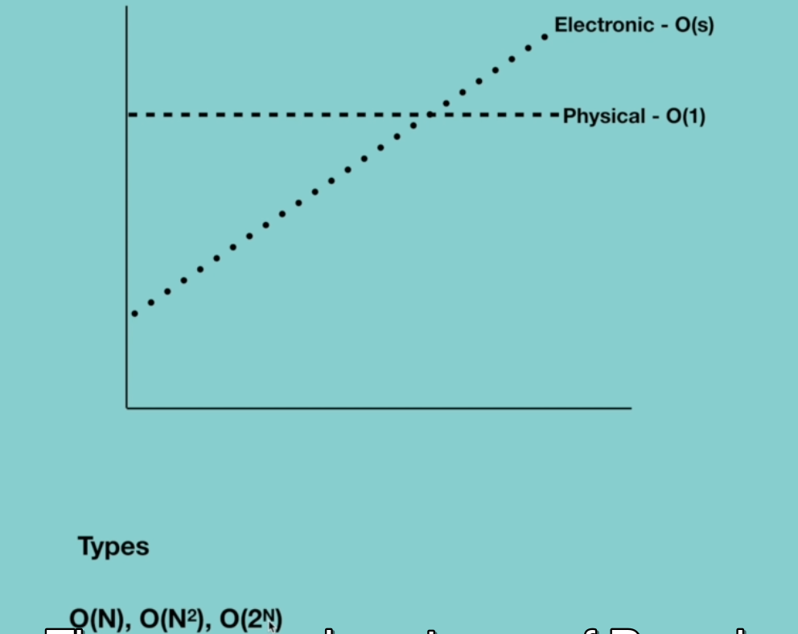

## Topic
On this section we will be talking about `Recursion`.

## Keywords and Notes
### What is Recursion?

`By definition`, it's a way of solving a problem by having a function calling itself.

`Recursion` - a way of solving a problem by having a function calling itself

> In computer Science, it's a method of solving a problem where the solution depends on the solution to the similar instance of the same problem.

Such problems can generally be solved by iteration as well. A real life example of recursion can be a `Russian nesting`, though hopefully you have seen a set of Russian, thought, if not, this is the picture how it looks like.

It is just one piece, so it does not open as you see it, thought, is a sequence of similar deals inside each other that can be open. But every time the size gets smaller and smaller, each time you open the door, a smaller version of those will be inside and you repeat the process until you reach the final goal that cannot be opened.

> There are many properties of recursion, so let's see properties of recursion based on this real life.So here, our example of Russian laws conform with the main properties of recursion.

* `Performing the same operation multiple times with different inputs`.

* `In every step we try smaller inputs to make the problem smaller`. So now you might be interested why we are making the problem smaller, because every time we make the problem smaller, this makes it easier to find the solution at the end, which is the smallest Russian.

* `Base condition is needed to stop the recursion, otherwise infinite loop will occur`.Basically, the basic condition is the condition, after that, we will not do any more recursion.We will stop the recursion because we either would have found the answer or the answer does not exist.

> What if we don't provide a base condition in this case? The system will not know when to stop recursion and this will lead to infinite loop.

```
const openRussianDoll = (doll)=>{
    if(doll == 1){
        console.log('All dolls are opened')
    }else{
        console.log(doll)
        openRussianDoll(doll-1)

    }
}

openRussianDoll(4)

//Expected output:
4
3
2
All dolls are opened
```

### Why we need Recursion?
`In this section we will look on why we need recursion`, So you might be interested why we need recursion?. There are many reasons for this, first of all, because of thinking is really important in programming and it helps you break down big into smaller one.

1.  Recursive thinking is really important in programming and it helps you break down big problems into smaller ones and easier to use.

> Recursion is used all the time in nearly every field, in nearly every language. If we compare the cost of way of writing code with iteratively, we can easily see that the recursive code is easy to write.
>
> Iteratively, of course, is basically where we use loops. so you might be interested if it is easier to write code, can we choose recursion over iteration? The answer is no, because there are situations where iteration performs faster than recursion. So it depends on the situation.
>
> `when to chose recursion` A good hint here is that if you can divide the problem into simple sub problems, then you can use recursion. The important point here is then problem must be similar, otherwise, recursion is not a choice.
>
> So how can we know that this problem is similar in nature. So when you hear a problem begins with the following statements, it's often  always a good candidate for recursion.

* If you can divide the problem into similar sub problems
* Design an algorithm to compute nth
* Write code to list n
* Implement a method to compute all
* Practice
> Finally, the best way to identify the problem is practice, the more problems you do, the easier it will be recognized because of problems.

2.  The second reason to use recursion is the `prominent usage of recursion in data structures like tree and graphs`

> So when you are dealing with trees, the recursion become almost mandatory to use.So in the upcoming sections, we'll explain three data structures.And there you will see that without recursion, some operation on trees become almost impossible.
>
> But it doesn't mean that you can't use the Iteration over there. But in this case, recursion is preferable due to the easier nature of write code.So without learning recursion, the upcoming section will be extremely difficult to understand.

3. So the third reason is that many companies ask questions related to recursion during the `interview`.

> So to pass these interviews to get better job, recursion become extremely important 

4. The fourth reason, is that `It is used in many algorithms` (divide and conquer, greedy and dynamic programming)

> So without the knowledge of recursion these topics becomes very difficult to learn.

### Big O Notation

So in this section, we will discuss about an important concept which is a `big o`. 

> `Big O` is the language and metric we use to describe the efficiency of algorithms.

Without understanding `Big O Notation` it is not possible to develope efficient algorithms.

If you don't know when you algorithm gets faster or slower, you'll struggle to judge your program performance.

This concept basically gives you one way to describe the amount of time it takes to run your function as the size of input grows.

> Imagine the scenario that you have a file on your hard drive and you need to send it to your friend. And we need to send this file as fast as possible.
>
>How would you send it?
> 
> The first thing that comes in our mind is that to send it by email or FTP or some other sort of electronic transfer, this is correct answer.
> If the file size is small, it is faster than to take it to your friend physically.
>
> What if the file size is really large?
>Is is possible that it's faster to physically deliver it via plane?
>Yes, actually,If it is one terabyte file could take more than one day to transfer it electronically.It will be much faster to just fly across the country if it is urgent, you might just want to do it.

So as you can see, the delivery method is changed based on the file size, this means in the first method the time that is needed for the transfer of file increases as the size of file increase, on the other hand, in the second method, the time that is needed to transfer a file to a friend does not depend on the size of the file. 

It does not matter if we carry one terabyte file or one gb file. The time that is needed for a flight is constant.So in computer science, this is called `time complexity`. It's a way of showing how a run time of the function increased as the size of input increases.

So if we compare our example of transferring a file to a friend, we can easily see that in terms of time complexity, 
>Electronic transfer increases linearly with the size of the file.
>
> But physical delivery is constant in any size.



There are various types of run time, such as `O(N), O(N^2), O(2^N)`

For instance, to paint an area of W meters (wide) and height meters (high). The runtime could be described as `O(wh)`

> Some algorithms are faster when the input is small, however, they become slower when the input gets larger.

It's very crucial that our programs run faster because they are not executed in supercomputers.If a mobile app users face low performance from the app, they tend to quit and leave the app.

### Big O Notations 
> In the last section, we have learned what is the logic behind the notation.

Now here we will look at different notations that are used in academics to describe rum times. But in the industry, people tend to use big o.

To understand different notations that are used to measure the performance of algorithms, let's look at real life example.

> Ok let say you want to by a brand new car, and obviously we want to know more about the performance of the car, which means that we are interested on how many litres of petrol it takes to driver 100 miles.

Now, in case of a car, there is not a standard answer for this question, even through in any car's manual it might mention that it takes, for example 70 litres of petrol for a hundred miles. This information is not true, because a car can perform differently based on the condition. This number can be different based on this condition, you are driving the car.

So if you drive the car in the city traffic, it's obvious that it takes more petrol, three hundred miles than when we drive it on the highway.

And there might be a situation in which we drive a car in mixed condition, both traffic and highway.

Let's imagine that it takes 
* City traffic - 20litres
* Highway - 10 litres
* Mixed condition - 15 litres

So here we see that the same car can perform differently based on the condition that we drive it. Similarly, algorithm can perform differently based on the condition that is given.

We have three scenarios in case of measuring of any given algorithm.These are
* Best case
* Average case
* Worst case


Let's say for an algorithm, it takes one minute to execute, in the worst case scenario, in the best case scenario, it takes just five seconds to execute, and finally, in the average case scenario, it takes 30 or 35 seconds escape.

So with the help of these three notation, we can define the best, worst, an average case of all. As an example, let's examine quicksort algorithm. 

Those who don't know what is quicksort algorithm, you don't need to worry about it because I will provide detail information in sorting algorithm section, about it.

But now you just need to know that it's an algorithm that supports an order list based on the selection of random number as a pilot number and swap greater values.


Let'ts look at this example over here to make things very clear. The first operation in this unsorted list targets the entire sequence of numbers. And the number is chosen as a reference for something which is called `pilot`, it is chosen at random.

This time for convenience, let's choose the right most number as the `pilot` here in our case we chose `five`, the next thing that we are going to do is to place `left marker (L)` and the `right marker (R)`. `Left marker (L)` is on the left most number and the `right marker(R)` is on the right most number.

Quicksort uses these markers to repeatedly perform rounds of operations recursively. The `left marker (L)` moves to the right in each step and compares the number with the `pilot number (P)` and stop when it reaches the number that's greater or equal to the `pilot number (P)`

>In our case, it stopped in the first case because `six is greater than five`, which is `pilot number`.

The the `right marker (R)` starts to move to the left, and this time when it reaches a number that is less than `pilot number`. In our case, it's three, which is less than five.

When both left and right markers have stopped, the markers are slapped, in our case, `six slapped with three`.

So the operation repeats like this until all the elements get sorted, so in the best scenario, all elements are equal and they pass over through the list, at least once, so for this case time complexity O(N). Because we are passing through all elements only once, and so if we have any elements in the list time complexity will be O(N).

In the worst case if we are unlucky. The pilot is repeatedly biggest element in the array, so the time complexity will be O(N^2)

In the average case, sometimes the pilot number will be very high and sometimes will be very low, but it will not happen over and over again. So in this case, time complexity will be O(log N). 

Now to express different scenarios of algorithms.There are three different legal notations.

* `Big O` : It is a complexity that is going to be less or equal to the worst case
>
> For example, if you want to sort 1000 numbers, Big O measures, the maximum time we need for this sorting. Let's say we need maximum 10 seconds to execute the algorithm.
> This means that the execution will never exceed and it can be eight or nine seconds, but it will never be more than 10 seconds in case of big O limiation.

* Big - (Big -Omega) : It is a complexity that is going to be at least more than the best case

>
> It is different from the big O limitation, here we measure the minimum time that we need to execute an algorithm, there might be cases that we want to know minimum time of algorithm execution, which means that if the best scenario for the execution of an algorithm is two seconds in terms of big O or mega, it will never be less than two seconds.
>
> For example, if you want to sort hundred numbers and we know that in the best case it takes two seconds. It will never be less than two seconds.Sometimes the information is useful for us, now in terms of the big data, it's the complexity that is within the bounds of worst and best cases. 
>
> This means that if we have an algorithm with maximum execution time, 10 seconds and minimum execution time, 12 seconds in terms of average time will be six seconds for execution.
>

> Let' imagine that we have an area of one million elements, and our goal is to find a given number within this array.If we want a certain number, which is located at the end of this array in our case, which is nine, we basically check each element one by one until we find the element that we are looking for.
>
> In this case, we will visit all elements of this array.Let's say the time that we need to visit each element is one millisecond, so the time that we need to visit, all of the elements will be and multiply with one, where n is the number of elements in the array?
>
>Ok, how can we represent the searching process in terms of big O notation, so in terms of big O notation, it will be O(N) and this means that the maximum time that we need to find any given number within this array is n. It would not be more than that, find the last number in the array, which is nine, it takes n multiply with one.
> So it will not be greater than O(N)
>
> In terms of big O Omega, it will be omega one.This means that the minimum time that is required for finding any given element is one, it will not be less than one to find any given number withing this array.
>
> In our case, it will never take less than one to find the first element in this are 

* Big Theta (Big -) : It is a complexity that is within bounds of the worst and the best cases.
>
> in terms of Big Theta, it will be theta(n/2), this is hte average time that is needed to find any given no, this is because for finding different numbers, we need various unit of time.So we need to take average of these numbers.
>
> We need to know all these three notation for academic purposes.But when it comes to the interviewees, we only need big O notation.


## Summary